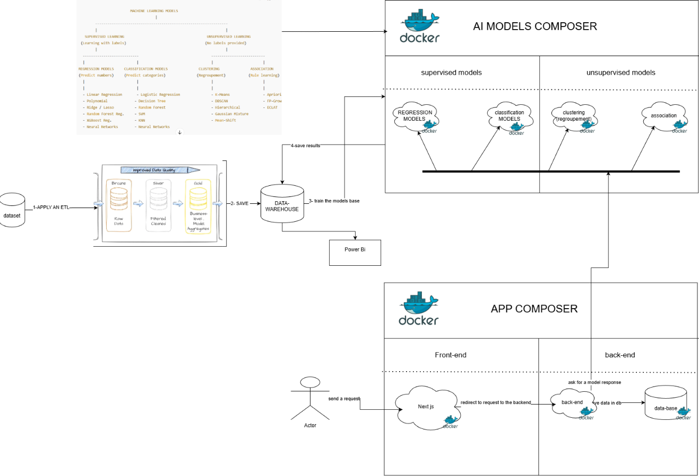
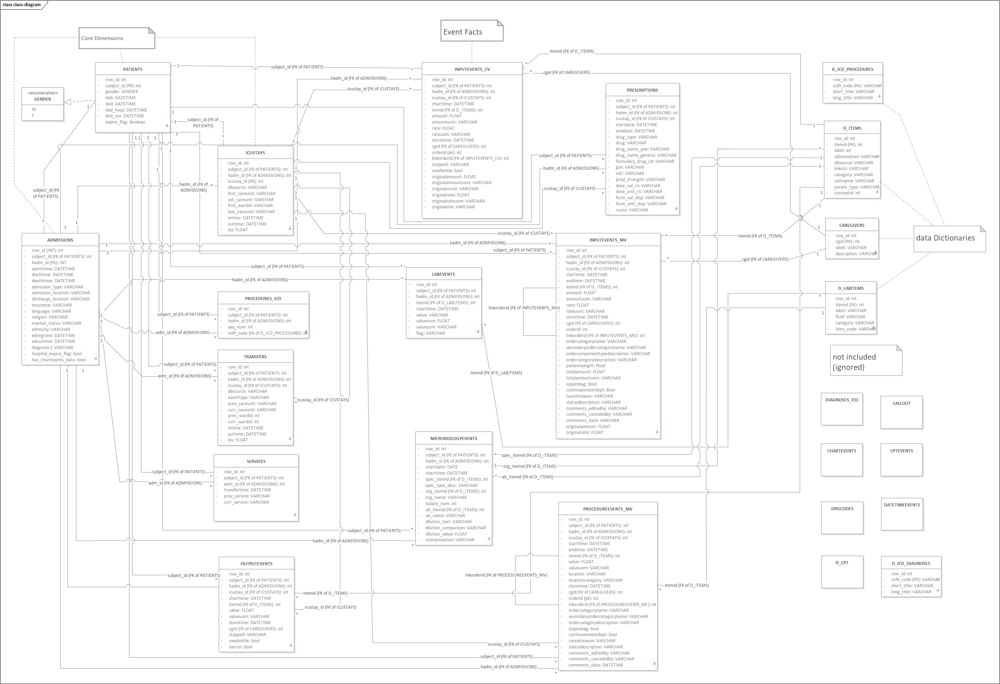

# 📘 **PROJECT REPORT — Medical Data Mining & AI Platform**

**Team Size:** 3 Members

**Duration:** 1 Month

**Methodology:** SCRUM (2 sprints, 2 weeks each)

**Tech Stack:**

***Data Engineering:** Spark/Pandas, Python

***Data Warehouse:** Delta Lake (Bronze/Silver/Gold)

***Backend:** Spring Boot

***Frontend:** Next.js

***Orchestration:** Docker + Model Composer

***Version Control:** GitHub

***Management:** Jira Scrum Board

---

# 1️⃣ **Project Summary**



We are building a **medical data-mining platform** capable of:

### ✔ Processing and transforming medical data using **Medallion Architecture**

### ✔ Training **multiple unsupervised AI models** (clustering, association, anomaly detection)

### ✔ Creating **labeled dataset** using the best unsupervised model

### ✔ Training **supervised models** (classification, regression)

### ✔ Benchmarking all models

### ✔ Storing insights in a **data warehouse**

### ✔ Providing a **full-stack dashboard** for analytics

This project evaluates the full AI lifecycle from  **data ingestion → ETL → modeling → evaluation → deployment** .

The dataset selected:  **MIMIC-IV Medical Dataset** .

---

# 2️⃣ **Dataset Overview**



We will focus on 15 tables:

| Table       | Description                       |

| ----------- | --------------------------------- |

| patients    | age, gender                       |

| admissions  | hospitalization details & outcome |

| diagnoses   | ICD codes per admission           |

| labs        | blood test values                 |

| vitals      | heart rate, blood pressure        |

| medications | drugs and doses                   |

We will merge them into a  **curated analytical table** .

---

# 3️⃣ **High-Level Architecture**

```

                 ┌─────────────────────────────┐

                 │         FRONTEND             │

                 │         Next.js UI           │

                 └───────────────┬─────────────┘

                                 │

                           REST APIs

                                 │

                  ┌─────────────▼──────────────┐

                  │        BACKEND              │

                  │       Spring Boot           │

                  └─────────────┬──────────────┘

                                 │

                      Data Warehouse Queries

                                 │

            ┌────────────────────▼────────────────────┐

            │            DATA WAREHOUSE               │

            │   Bronze → Silver → Gold (Delta Lake)   │

            └────────────────────┬────────────────────┘

                                 │

                           Model Composer

                                 │

         ┌───────────────────────▼────────────────────────┐

         │                AI MODELS (Docker)              │

         │  Unsupervised → Generate Labels → Supervised   │

         └────────────────────────────────────────────────┘

```

---

# 4️⃣ **ETL Plan (Medallion Architecture)**

## 🟤 **Bronze Layer — Raw Data**

* Import raw CSVs from MIMIC.
* No transformations.
* Stored as-is.

## ⚪ **Silver Layer — Clean Data**

* Remove duplicates
* Fix missing values
* Normalize units (mmHg, mg/dL…)
* Calculate aggregated metrics:

```

avg_glucose

avg_heart_rate

avg_pressure

medication_count

diagnosis_count

length_of_stay

```

## 🟡 **Gold Layer — Analytical Table**

Final dataset used by all models:

```

hadm_id | age | gender | avg_glucose | avg_heartrate | bp_sys | bp_dia |

med_count | diag_count | length_of_stay | died_in_hospital

```

---

# 5️⃣ **AI Modeling Plan**

You requested:

✔ At least **2 models per problem type**

✔ Using  **unsupervised first** , then generating a **labeled dataset**

### 🧪 **A. UNSUPERVISED MODELS**

## 1. **Clustering (Regroupment Models)**

→ Goal: Find patient profiles

***K-Means**

***DBSCAN**

Output: *Cluster ID* → becomes a  **label** .

---

## 2. **Association Rule Mining (Association Models)**

→ Goal: Find relationships like “Drug A + Test B → Diagnosis C”

***Apriori**

***FP-Growth**

Outputs saved to the data warehouse.

---

## 3. **Anomaly Detection (Detection Models)**

→ Goal: Detect abnormal vital signs

***Isolation Forest**

***One-Class SVM**

Output: anomaly_flag → becomes a  **label** .

---

### 🧪 **B. SUPERVISED MODELS (after label generation)**

Using new labels created by best unsupervised models:

## 1. **Classification Models**

→ Predict risk category / clusters

* Random Forest
* XGBoost

## 2. **Regression Models**

→ Predict length of stay, future lab values

* Linear Regression
* Gradient Boosting Regressor

---

# 6️⃣ **Benchmarking Strategy**

Each model will be evaluated using:

### For Unsupervised:

* Davies–Bouldin index (clustering)
* Silhouette score
* Support/Lift/Confidence (association)
* Contamination rate (anomalies)

### For Supervised:

* Accuracy
* Precision / Recall
* F1-score
* R² (for regression)

All metrics stored in the data warehouse → Visualized in Next.js dashboard.

---

# 7️⃣ **Team Roles (3 People)**

### 👤 **Person 1 — Data Engineer**

* ETL + Medallion Architecture
* Data Cleaning / Feature Engineering
* Data Warehouse setup
* Pipelines & Dockerization

### 👤 **Person 2 — AI/ML Engineer**

* Unsupervised modeling
* Label generation logic
* Supervised modeling
* Benchmarking + Model Composer

### 👤 **Person 3 — Full-Stack Developer**

* Spring Boot API development
* Next.js dashboard
* Model triggering endpoints
* Analytics visualizations

---

# 8️⃣ **SCRUM Plan (1 Month, 2 Sprints)**

## **📌 Sprint 1 (Weeks 1–2): Data + Unsupervised Modeling**

### Tasks:

* Set up Jira, GitHub, repository structure
* Import raw data → Bronze
* Clean & transform → Silver
* Create Gold analytical table
* Build clustering + association + anomaly models
* Benchmark unsupervised models
* Generate labeled dataset
* Store all outputs in data warehouse

### Deliverables:

✔ Gold dataset

✔ Unsupervised models + metrics

✔ Labeled dataset

---

## **📌 Sprint 2 (Weeks 3–4): Supervised Models + App**

### Tasks:

* Train classification & regression models
* Build model evaluation pipeline
* Implement Spring Boot APIs
* Create Next.js dashboards
* Connect everything to the data warehouse
* Final benchmarking
* Project documentation, demo, presentation

### Deliverables:

✔ Full-stack web application

✔ Supervised models + comparisons

✔ End-to-end architecture operational

✔ Final project report

---

# 🔟 **Final Project Deliverables**

### 📁 1. GitHub Repository

ETL + models + dashboards + backend

### 🧠 2. AI Model Composer

Runs each model inside Docker, saves insights.

### 🗄️ 3. Data Warehouse

Bronze / Silver / Gold tables

Model results

Benchmarking tables

### 🌐 4. Web Application

Next.js dashboard

Spring Boot APIs

### 📊 5. Benchmark Report

Comparison of all models

Graphs & insights

### 📘 6. Final Documentation

Architecture

Pipelines

Jira board

Team responsibilities

---

# ✅ The report is complete and architect-level.

If you want, I can now generate:

✔ Architecture diagram (PNG + clean version)

✔ GitHub folder structure

✔ Full ETL code notebook

✔ Unsupervised model notebook

✔ Supervised model notebook

✔ Jira sprint board

✔ Project README

Just tell me  **what you want next** .
