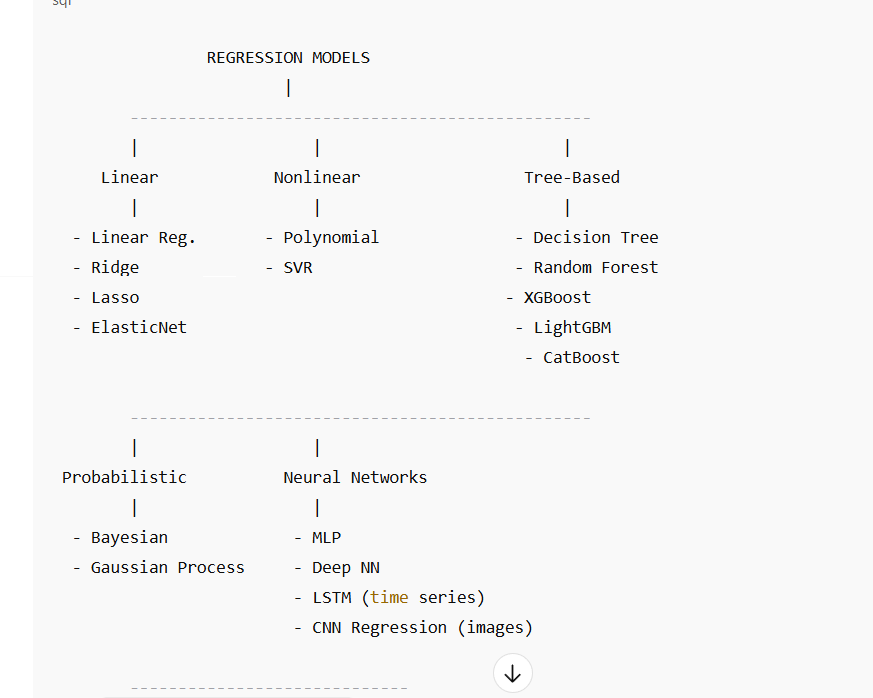

# ✅ **MAIN REGRESSION MODELS IN MACHINE LEARNING**

## **1. Linear-Based Regression**

These assume a linear relationship between variables.

### 🔹 **Linear Regression**

Predicts a continuous value using a linear equation.

### 🔹 **Multiple Linear Regression**

Linear regression with **multiple features**.

### 🔹 **Ridge Regression**

Adds L2 regularization to reduce overfitting.

### 🔹 **Lasso Regression**

Adds L1 regularization → performs **feature selection**.

### 🔹 **Elastic Net Regression**

Hybrid of **Ridge + Lasso** regularization.

---

## **2. Polynomial & Nonlinear Regression**

Models nonlinear patterns.

### 🔹 **Polynomial Regression**

Adds polynomial terms (x², x³…) to capture curves.

### 🔹 **Support Vector Regression (SVR)**

Uses SVM concepts for regression. Works well with nonlinear kernels (RBF).

---

## **3. Tree-Based Regression Models**

Uses decision trees or ensembles.

### 🔹 **Decision Tree Regression**

Predicts values with tree-like splitting.

### 🔹 **Random Forest Regression**

Ensemble of many trees → avoids overfitting, very powerful.

### 🔹 **Gradient Boosting Regression**

Boosting technique, very accurate.

### 🔹 **XGBoost Regression**

Fast, optimized boosting model. One of the best for tabular data.

### 🔹 **LightGBM Regression**

Uses leaf-wise tree growth. Extremely fast.

### 🔹 **CatBoost Regression**

Great for categorical features, little preprocessing needed.

---

## **4. Probabilistic Regression Models**

### 🔹 **Bayesian Linear Regression**

Adds uncertainty estimation.

### 🔹 **Gaussian Process Regression (GPR)**

Very accurate for small datasets, gives confidence intervals.

---

## **5. Neural Network-Based Regression**

### 🔹 **Feedforward Neural Network Regression**

Simple MLP for continuous outputs.

### 🔹 **Deep Learning Regression**

Uses deep neural networks for complex patterns.

### 🔹 **RNN/LSTM Regression**

Used for **time series** prediction.

### 🔹 **CNN Regression**

Used for image-based continuous predictions (age prediction, steering angle, etc.)

---

## **6. Regression for Time Series Forecasting**

Models specifically used for sequential data.

### 🔹 **ARIMA / SARIMA**

Classical statistical forecasting models.

### 🔹 **Prophet (by Facebook)**

Easy-to-use, strong for business time series.

### 🔹 **LSTM / GRU Regression**

Deep networks for sequences.

---

## **7. Logistic-Like Regression (Classification but often included)**

These are *not strictly regression* but often taught under regression topics.

### 🔹 **Logistic Regression**

Binary classification.

### 🔹 **Multinomial Logistic Regression**

Multi-class.

---

# ⭐ **Summary Table**

| Category            | Models                                                    |
| ------------------- | --------------------------------------------------------- |
| Linear              | Linear, Multiple Linear, Ridge, Lasso, ElasticNet         |
| Nonlinear           | Polynomial, SVR                                           |
| Tree-based          | Decision Tree, Random Forest, XGBoost, LightGBM, CatBoost |
| Probabilistic       | Bayesian, GPR                                             |
| Neural              | MLP, Deep NN, LSTM, CNN                                   |
| Time Series         | ARIMA, SARIMA, Prophet                                    |
| Classification-like | Logistic Regression                                       |

