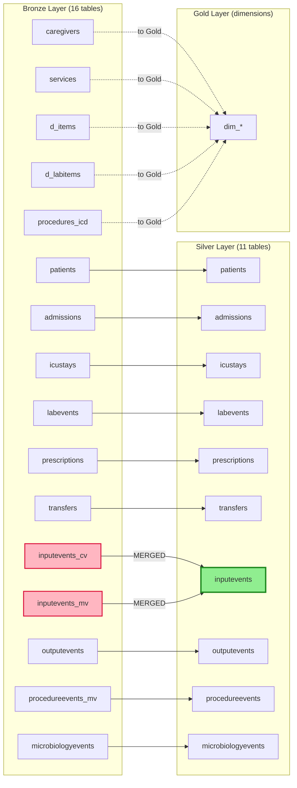
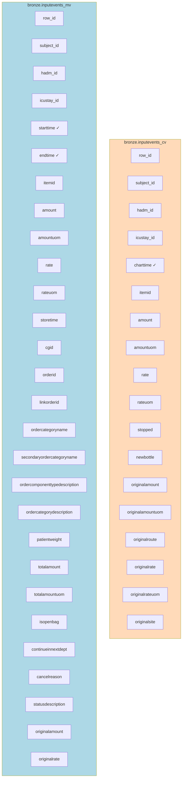
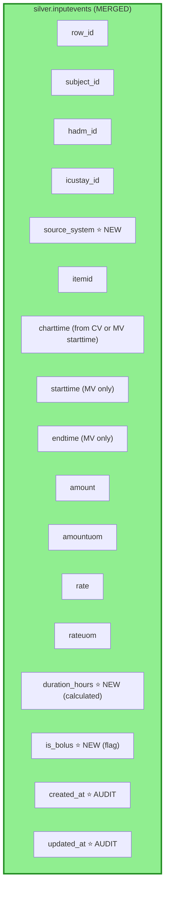
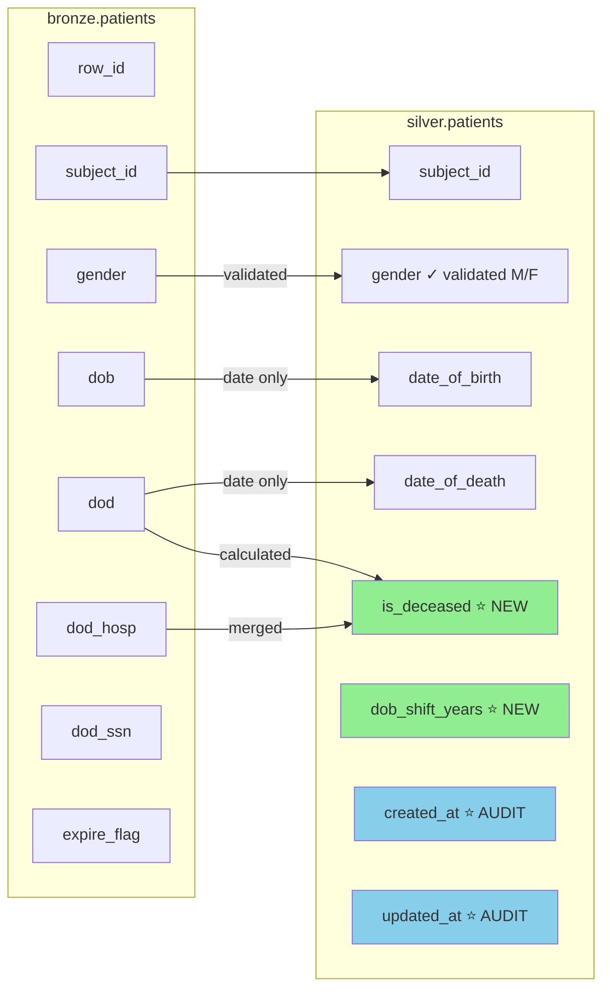
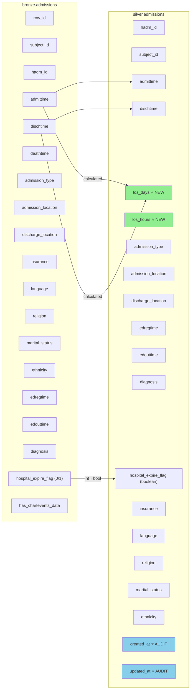
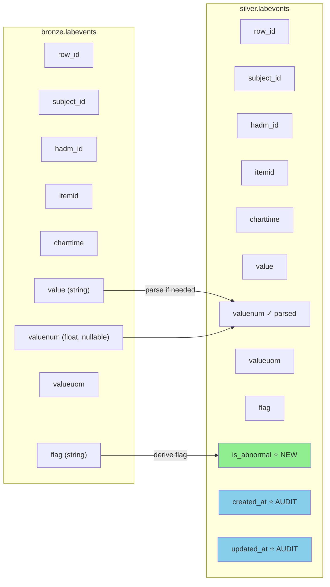

# Bronze vs Silver Layer - Detailed Comparison

This document provides a comprehensive comparison between the Bronze and Silver layers in the MIMIC-III data warehouse, including transformation details and visual diagrams.

---

## Executive Summary

| Aspect | Bronze Layer | Silver Layer |
|--------|--------------|--------------|
| **Purpose** | Raw data storage (as-is from CSV) | Cleaned, validated, enriched data |
| **Tables** | 16 tables | 11 tables |
| **Schema** | `bronze.*` | `silver.*` |
| **Data Quality** | None (raw) | Validated, standardized |
| **Calculations** | None | LOS, durations, flags |
| **Audit Trail** | None | `created_at`, `updated_at` |

---

## Transformation Statistics

```
Bronze Layer: 16 tables
Silver Layer: 11 tables
─────────────────────────
• 1 MERGE:        inputevents_cv + inputevents_mv → inputevents
• 9 TRANSFORMS:   1:1 mapping with calculated fields
• 5 SKIPPED:      Reference/dictionary tables (→ Gold dimensions)
• 1 MISSING:      noteevents (CSV file not found)
```

### Merged Tables (2 → 1)

| Bronze Tables | Silver Table | Reason |
|---------------|--------------|--------|
| `inputevents_cv` (CareVue) | `inputevents` | Different ICU systems, same data type |
| `inputevents_mv` (MetaVision) | | Unified with `source_system` field |

### Transformed Tables (1:1 with enrichment)

| Bronze Table | Silver Table | Key Additions |
|--------------|--------------|---------------|
| `patients` | `patients` | `is_deceased`, validated gender |
| `admissions` | `admissions` | `los_days`, `los_hours` |
| `icustays` | `icustays` | `los_icu_days`, `los_icu_hours` |
| `labevents` | `labevents` | Parsed `valuenum`, `is_abnormal` |
| `prescriptions` | `prescriptions` | Parsed doses, `duration_days` |
| `transfers` | `transfers` | `duration_hours`, `is_icu_transfer` |
| `outputevents` | `outputevents` | Standardized measurements |
| `procedureevents_mv` | `procedureevents` | `is_completed`, `is_canceled` |
| `microbiologyevents` | `microbiologyevents` | `is_positive`, `is_resistant` |

### Skipped Tables (→ Gold Layer)

| Bronze Table | Reason | Gold Destination |
|--------------|--------|------------------|
| `caregivers` | Reference data | `dim_caregiver` |
| `services` | Reference data | `dim_service` |
| `d_items` | Dictionary | `dim_item` |
| `d_labitems` | Dictionary | `dim_labitem` |
| `procedures_icd` | Code mappings | `dim_procedure` |

---

## Table Mapping Diagram



---

## Merged Tables Detail: InputEvents

The most significant transformation is merging two separate Bronze tables into one Silver table.

### Before (Bronze): 2 Separate Tables



### After (Silver): 1 Unified Table



### Merge Logic

```python
# CareVue records
{
    "source_system": "CareVue",
    "charttime": bronze.charttime,      # CV uses charttime
    "starttime": None,                  # CV doesn't have start/end
    "endtime": None,
    "is_bolus": bronze.rate is None,    # No rate = bolus
}

# MetaVision records  
{
    "source_system": "MetaVision",
    "charttime": bronze.starttime,      # MV uses starttime as charttime
    "starttime": bronze.starttime,
    "endtime": bronze.endtime,
    "duration_hours": (endtime - starttime) / 3600,
    "is_bolus": bronze.orderid is None,
}
```

---

## Detailed Table Comparisons

### 1. PATIENTS



| Bronze Column | Silver Column | Transformation |
|---------------|---------------|----------------|
| `row_id` | ❌ Removed | Not needed as PK |
| `subject_id` | `subject_id` | Primary key |
| `gender` | `gender` | **Validated**: Only M/F allowed |
| `dob` | `date_of_birth` | DateTime → Date |
| `dod` | `date_of_death` | DateTime → Date |
| `dod_hosp` | ❌ Removed | Merged into `is_deceased` |
| `dod_ssn` | ❌ Removed | Merged into `is_deceased` |
| `expire_flag` | ❌ Removed | Replaced by `is_deceased` |
| ❌ | `is_deceased` | **NEW**: Boolean flag |
| ❌ | `dob_shift_years` | **NEW**: Age anonymization info |
| ❌ | `created_at` | **NEW**: Audit timestamp |
| ❌ | `updated_at` | **NEW**: Audit timestamp |

---

### 2. ADMISSIONS



**Key Transformation - LOS Calculation:**
```python
los_days = (dischtime - admittime).total_seconds() / 86400
los_hours = (dischtime - admittime).total_seconds() / 3600
```

---

### 3. ICUSTAYS

| Bronze Column | Silver Column | Transformation |
|---------------|---------------|----------------|
| `icustay_id` | `icustay_id` | Primary key |
| `subject_id` | `subject_id` | Foreign key |
| `hadm_id` | `hadm_id` | Foreign key |
| `first_careunit` | `first_careunit` | No change |
| `last_careunit` | `last_careunit` | No change |
| `first_wardid` | `first_wardid` | No change |
| `last_wardid` | `last_wardid` | No change |
| `intime` | `intime` | No change |
| `outtime` | `outtime` | No change |
| `los` | ❌ Removed | Replaced by calculated fields |
| ❌ | `los_icu_days` | **NEW**: Calculated from timestamps |
| ❌ | `los_icu_hours` | **NEW**: Calculated from timestamps |

**Why recalculate LOS?**
- Bronze `los` may have inconsistencies
- Silver calculates from actual timestamps for accuracy

---

### 4. LABEVENTS



**Value Parsing Logic:**
```python
# Bronze value might be: ">10", "<0.5", "NEGATIVE", "5.5"
def parse_numeric(value):
    if not value:
        return None
    value = value.strip()
    for prefix in ['>', '<', '>=', '<=', '~']:
        if value.startswith(prefix):
            value = value[len(prefix):]
    try:
        return float(value)
    except:
        return None

# Use bronze valuenum if available, else parse
silver_valuenum = bronze.valuenum or parse_numeric(bronze.value)
```

**Abnormal Flag Logic:**
```python
is_abnormal = bronze.flag.upper() in ['ABNORMAL', 'H', 'L', 'A', 'HIGH', 'LOW']
```

---

### 5. PRESCRIPTIONS

| Bronze Column | Silver Column | Transformation |
|---------------|---------------|----------------|
| `dose_val_rx` | `dose_val_rx` | **Parsed to float** |
| `form_val_disp` | `form_val_disp` | **Parsed to float** |
| `startdate` | `startdate` | No change |
| `enddate` | `enddate` | No change |
| ❌ | `duration_days` | **NEW**: `enddate - startdate` |

---

### 6. TRANSFERS

| Bronze Column | Silver Column | Transformation |
|---------------|---------------|----------------|
| `intime` | `intime` | No change |
| `outtime` | `outtime` | No change |
| `curr_careunit` | `curr_careunit` | No change |
| ❌ | `duration_hours` | **NEW**: `outtime - intime` |
| ❌ | `is_icu_transfer` | **NEW**: Boolean flag if ICU |

**ICU Detection:**
```python
ICU_UNITS = ['MICU', 'SICU', 'CCU', 'CSRU', 'TSICU', 'NICU', 'NWARD']
is_icu_transfer = curr_careunit in ICU_UNITS or prev_careunit in ICU_UNITS
```

---

### 7. PROCEDUREEVENTS

| Bronze Column | Silver Column | Transformation |
|---------------|---------------|----------------|
| `statusdescription` | `status_description` | Renamed |
| `cancelreason` | ❌ | Replaced by `is_canceled` |
| ❌ | `is_completed` | **NEW**: Boolean flag |
| ❌ | `is_canceled` | **NEW**: Boolean flag |
| ❌ | `duration_hours` | **NEW**: `endtime - starttime` |

---

### 8. MICROBIOLOGYEVENTS

| Bronze Column | Silver Column | Transformation |
|---------------|---------------|----------------|
| `org_name` | `org_name` | No change |
| `interpretation` | `interpretation` | No change |
| ❌ | `is_positive` | **NEW**: `org_name is not null` |
| ❌ | `is_resistant` | **NEW**: `interpretation == 'R'` |

---

## Summary: New Silver Fields

### Calculated Metrics (from timestamps)
| Field | Table | Calculation |
|-------|-------|-------------|
| `los_days` | admissions | `(dischtime - admittime) / 86400` |
| `los_hours` | admissions | `(dischtime - admittime) / 3600` |
| `los_icu_days` | icustays | `(outtime - intime) / 86400` |
| `los_icu_hours` | icustays | `(outtime - intime) / 3600` |
| `duration_hours` | transfers, procedures, inputs | `(end - start) / 3600` |
| `duration_days` | prescriptions | `enddate - startdate` |

### Boolean Flags (derived from data)
| Field | Table | Logic |
|-------|-------|-------|
| `is_deceased` | patients | `dod IS NOT NULL` |
| `is_abnormal` | labevents | `flag IN ('H', 'L', 'A')` |
| `is_icu_transfer` | transfers | `careunit IN ICU_UNITS` |
| `is_completed` | procedures | `status != 'CANCELED'` |
| `is_canceled` | procedures | `status == 'CANCELED'` |
| `is_positive` | microbiology | `org_name IS NOT NULL` |
| `is_resistant` | microbiology | `interpretation == 'R'` |
| `is_bolus` | inputevents | `rate IS NULL OR orderid IS NULL` |

### Data Quality Fields
| Field | Table | Purpose |
|-------|-------|---------|
| `source_system` | inputevents | Tracks origin (CareVue/MetaVision) |
| `created_at` | ALL | When record was created in silver |
| `updated_at` | ALL | When record was last modified |

---

## Tables Not Transformed to Silver

These tables skip Silver and go directly to Gold as dimension tables:

| Bronze Table | Reason | Gold Destination |
|--------------|--------|------------------|
| `caregivers` | Reference data | `dim_caregiver` |
| `services` | Reference data | `dim_service` |
| `d_items` | Dictionary | `dim_item` |
| `d_labitems` | Dictionary | `dim_labitem` |
| `procedures_icd` | Code mappings | `dim_procedure` |
| `noteevents` | ❌ CSV not found | Skip |

---

## Data Quality Improvements

| Issue in Bronze | Fix in Silver |
|-----------------|---------------|
| Null `valuenum` with parseable `value` | Parse numeric from string |
| Multiple death columns (`dod`, `dod_hosp`) | Single `is_deceased` flag |
| Integer flags (0/1) | Boolean types |
| Separate CV/MV tables | Unified with `source_system` |
| Missing LOS | Calculated from timestamps |
| String dates | Proper date types |
| Inconsistent gender values | Validated M/F only |
