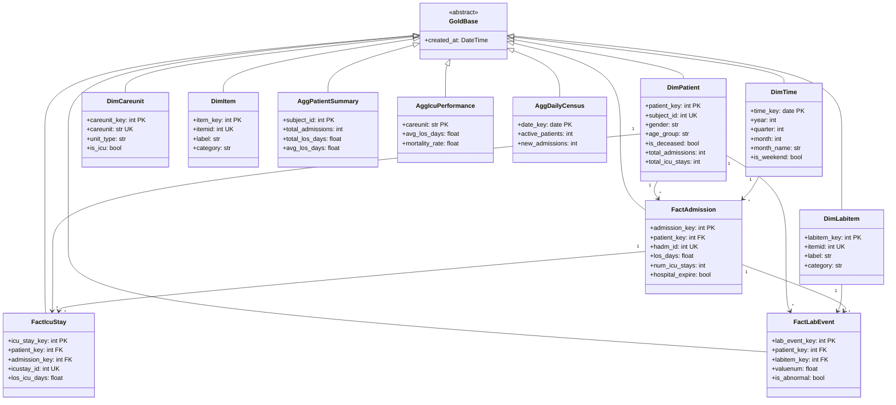

# Gold Layer Implementation Plan

## Overview

The Gold layer provides **business-ready, analytics-optimized** data using a Star Schema design. This plan covers ALL Silver tables and their transformation to Gold.

---

## Source Tables Summary

### Silver Layer (11 tables) → Gold Layer

| Silver Table | Gold Destination | Type |
|--------------|------------------|------|
| `silver.patients` | `dim_patient`, `agg_patient_summary` | Dimension + Aggregate |
| `silver.admissions` | `fact_admission`, `agg_daily_census` | Fact + Aggregate |
| `silver.icustays` | `fact_admission`, `agg_icu_performance` | Fact + Aggregate |
| `silver.labevents` | `fact_lab_event`, `agg_lab_summary` | Fact + Aggregate |
| `silver.prescriptions` | `fact_prescription`, `agg_medication_usage` | Fact + Aggregate |
| `silver.transfers` | `fact_transfer` | Fact |
| `silver.inputevents` | `fact_input_event` | Fact |
| `silver.outputevents` | `fact_output_event` | Fact |
| `silver.procedureevents` | `fact_procedure` | Fact |
| `silver.microbiologyevents` | `fact_microbiology`, `agg_infection_stats` | Fact + Aggregate |

### Bronze Reference Tables → Gold Dimensions

| Bronze Table | Gold Dimension |
|--------------|----------------|
| `bronze.d_items` | `dim_item` |
| `bronze.d_labitems` | `dim_labitem` |
| `bronze.caregivers` | `dim_caregiver` |
| `bronze.services` | `dim_service` |
| `bronze.procedures_icd` | `dim_procedure_icd` |

---

## Architecture: Star Schema


---

## Class Diagram (Python Models)



---

## Complete Table List

### Dimension Tables (8 tables)

| Table | Source | Key Columns |
|-------|--------|-------------|
| `dim_patient` | silver.patients | subject_id, gender, age_group, is_deceased |
| `dim_time` | Generated | date, year, quarter, month, week, day_of_week |
| `dim_careunit` | bronze.caregivers | careunit_id, unit_name, unit_type |
| `dim_item` | bronze.d_items | itemid, label, category, unitname |
| `dim_labitem` | bronze.d_labitems | itemid, label, fluid, category, loinc_code |
| `dim_service` | bronze.services | service_id, service_name |
| `dim_procedure_icd` | bronze.procedures_icd | icd9_code, short_title, long_title |
| `dim_caregiver` | bronze.caregivers | cgid, label, description |

### Fact Tables (9 tables)

| Table | Source | Grain | Key Metrics |
|-------|--------|-------|-------------|
| `fact_admission` | silver.admissions + icustays | Per admission | los_days, icu_los, expire_flag, readmit_30d |
| `fact_lab_event` | silver.labevents | Per lab test | valuenum, is_abnormal |
| `fact_prescription` | silver.prescriptions | Per prescription | duration_days, dose |
| `fact_transfer` | silver.transfers | Per transfer | duration_hours, is_icu |
| `fact_input_event` | silver.inputevents | Per input | amount, rate, duration |
| `fact_output_event` | silver.outputevents | Per output | value |
| `fact_procedure` | silver.procedureevents | Per procedure | duration, is_completed |
| `fact_microbiology` | silver.microbiologyevents | Per culture | is_positive, is_resistant |
| `fact_icu_stay` | silver.icustays | Per ICU stay | los_icu_days, careunit |

### Aggregate Tables (7 tables)

| Table | Grain | Key Metrics |
|-------|-------|-------------|
| `agg_patient_summary` | Per patient | total_admissions, total_los, mortality |
| `agg_admission_metrics` | Per admission | all counts, readmission flag |
| `agg_daily_census` | Per day | admissions, discharges, deaths, occupancy |
| `agg_icu_performance` | Per ICU unit | avg_los, mortality_rate, occupancy |
| `agg_lab_summary` | Per patient/lab | min, max, avg, abnormal_rate |
| `agg_medication_usage` | Per drug | frequency, avg_duration, patient_count |
| `agg_infection_stats` | Per organism | positive_rate, resistance_rate |

---

## Detailed Table Designs

### dim_patient

```sql
CREATE TABLE gold.dim_patient (
    patient_key         SERIAL PRIMARY KEY,
    subject_id          INT NOT NULL UNIQUE,
    gender              VARCHAR(1),
    age_group           VARCHAR(20),
    is_deceased         BOOLEAN DEFAULT FALSE,
    total_admissions    INT DEFAULT 0,
    total_icu_stays     INT DEFAULT 0,
    first_admission     TIMESTAMP,
    last_admission      TIMESTAMP,
    created_at          TIMESTAMP DEFAULT NOW(),
    updated_at          TIMESTAMP DEFAULT NOW()
);
```

### dim_time

```sql
CREATE TABLE gold.dim_time (
    time_key            DATE PRIMARY KEY,
    year                INT NOT NULL,
    quarter             INT NOT NULL,
    month               INT NOT NULL,
    month_name          VARCHAR(10) NOT NULL,
    week_of_year        INT NOT NULL,
    day_of_month        INT NOT NULL,
    day_of_week         INT NOT NULL,
    day_name            VARCHAR(10) NOT NULL,
    is_weekend          BOOLEAN NOT NULL
);
```

### dim_item

```sql
CREATE TABLE gold.dim_item (
    item_key            SERIAL PRIMARY KEY,
    itemid              INT NOT NULL UNIQUE,
    label               VARCHAR(200),
    abbreviation        VARCHAR(100),
    category            VARCHAR(100),
    unitname            VARCHAR(100),
    linksto             VARCHAR(50),
    created_at          TIMESTAMP DEFAULT NOW()
);
```

### dim_labitem

```sql
CREATE TABLE gold.dim_labitem (
    labitem_key         SERIAL PRIMARY KEY,
    itemid              INT NOT NULL UNIQUE,
    label               VARCHAR(200),
    fluid               VARCHAR(100),
    category            VARCHAR(100),
    loinc_code          VARCHAR(100),
    created_at          TIMESTAMP DEFAULT NOW()
);
```

### fact_admission

```sql
CREATE TABLE gold.fact_admission (
    admission_key       SERIAL PRIMARY KEY,
    patient_key         INT REFERENCES gold.dim_patient,
    admit_date_key      DATE REFERENCES gold.dim_time,
    disch_date_key      DATE REFERENCES gold.dim_time,
    hadm_id             INT NOT NULL UNIQUE,
    admission_type      VARCHAR(50),
    admission_location  VARCHAR(100),
    discharge_location  VARCHAR(100),
    insurance           VARCHAR(50),
    los_days            FLOAT,
    los_hours           FLOAT,
    icu_los_days        FLOAT,
    num_icu_stays       INT DEFAULT 0,
    num_lab_tests       INT DEFAULT 0,
    num_prescriptions   INT DEFAULT 0,
    num_procedures      INT DEFAULT 0,
    num_transfers       INT DEFAULT 0,
    hospital_expire     BOOLEAN DEFAULT FALSE,
    is_readmit_30day    BOOLEAN DEFAULT FALSE,
    days_to_readmit     INT,
    created_at          TIMESTAMP DEFAULT NOW()
);
```

### fact_lab_event

```sql
CREATE TABLE gold.fact_lab_event (
    lab_event_key       SERIAL PRIMARY KEY,
    patient_key         INT REFERENCES gold.dim_patient,
    admission_key       INT REFERENCES gold.fact_admission,
    labitem_key         INT REFERENCES gold.dim_labitem,
    chart_date_key      DATE REFERENCES gold.dim_time,
    row_id              INT NOT NULL,
    charttime           TIMESTAMP,
    value               VARCHAR(200),
    valuenum            FLOAT,
    valueuom            VARCHAR(50),
    is_abnormal         BOOLEAN DEFAULT FALSE,
    created_at          TIMESTAMP DEFAULT NOW()
);
```

### fact_prescription

```sql
CREATE TABLE gold.fact_prescription (
    prescription_key    SERIAL PRIMARY KEY,
    patient_key         INT REFERENCES gold.dim_patient,
    admission_key       INT REFERENCES gold.fact_admission,
    start_date_key      DATE REFERENCES gold.dim_time,
    row_id              INT NOT NULL,
    drug                VARCHAR(200),
    drug_name_generic   VARCHAR(200),
    drug_type           VARCHAR(100),
    dose_val            FLOAT,
    dose_unit           VARCHAR(50),
    route               VARCHAR(50),
    duration_days       FLOAT,
    created_at          TIMESTAMP DEFAULT NOW()
);
```

### fact_icu_stay

```sql
CREATE TABLE gold.fact_icu_stay (
    icu_stay_key        SERIAL PRIMARY KEY,
    patient_key         INT REFERENCES gold.dim_patient,
    admission_key       INT REFERENCES gold.fact_admission,
    careunit_key        INT REFERENCES gold.dim_careunit,
    in_date_key         DATE REFERENCES gold.dim_time,
    icustay_id          INT NOT NULL UNIQUE,
    first_careunit      VARCHAR(50),
    last_careunit       VARCHAR(50),
    intime              TIMESTAMP,
    outtime             TIMESTAMP,
    los_icu_days        FLOAT,
    los_icu_hours       FLOAT,
    created_at          TIMESTAMP DEFAULT NOW()
);
```

### fact_microbiology

```sql
CREATE TABLE gold.fact_microbiology (
    micro_key           SERIAL PRIMARY KEY,
    patient_key         INT REFERENCES gold.dim_patient,
    admission_key       INT REFERENCES gold.fact_admission,
    chart_date_key      DATE REFERENCES gold.dim_time,
    row_id              INT NOT NULL,
    spec_type_desc      VARCHAR(100),
    org_name            VARCHAR(200),
    ab_name             VARCHAR(200),
    interpretation      VARCHAR(5),
    is_positive         BOOLEAN DEFAULT FALSE,
    is_resistant        BOOLEAN DEFAULT FALSE,
    created_at          TIMESTAMP DEFAULT NOW()
);
```

### agg_patient_summary

```sql
CREATE TABLE gold.agg_patient_summary (
    subject_id          INT PRIMARY KEY,
    patient_key         INT REFERENCES gold.dim_patient,
    gender              VARCHAR(1),
    age_group           VARCHAR(20),
    is_deceased         BOOLEAN,
    total_admissions    INT DEFAULT 0,
    total_icu_stays     INT DEFAULT 0,
    total_los_days      FLOAT DEFAULT 0,
    avg_los_days        FLOAT,
    total_lab_tests     INT DEFAULT 0,
    total_prescriptions INT DEFAULT 0,
    total_procedures    INT DEFAULT 0,
    first_admission     TIMESTAMP,
    last_admission      TIMESTAMP,
    readmit_30day_count INT DEFAULT 0,
    created_at          TIMESTAMP DEFAULT NOW()
);
```

### agg_daily_census

```sql
CREATE TABLE gold.agg_daily_census (
    date_key            DATE PRIMARY KEY REFERENCES gold.dim_time,
    active_patients     INT DEFAULT 0,
    new_admissions      INT DEFAULT 0,
    discharges          INT DEFAULT 0,
    deaths              INT DEFAULT 0,
    icu_patients        INT DEFAULT 0,
    new_icu_admits      INT DEFAULT 0,
    icu_discharges      INT DEFAULT 0,
    avg_los_discharged  FLOAT,
    created_at          TIMESTAMP DEFAULT NOW()
);
```

### agg_icu_performance

```sql
CREATE TABLE gold.agg_icu_performance (
    careunit            VARCHAR(50) PRIMARY KEY,
    total_stays         INT DEFAULT 0,
    total_patients      INT DEFAULT 0,
    avg_los_days        FLOAT,
    median_los_days     FLOAT,
    max_los_days        FLOAT,
    mortality_count     INT DEFAULT 0,
    mortality_rate      FLOAT,
    readmit_48h_count   INT DEFAULT 0,
    readmit_48h_rate    FLOAT,
    avg_labs_per_stay   FLOAT,
    created_at          TIMESTAMP DEFAULT NOW()
);
```

### agg_lab_summary

```sql
CREATE TABLE gold.agg_lab_summary (
    summary_key         SERIAL PRIMARY KEY,
    patient_key         INT REFERENCES gold.dim_patient,
    labitem_key         INT REFERENCES gold.dim_labitem,
    subject_id          INT,
    itemid              INT,
    test_count          INT DEFAULT 0,
    min_value           FLOAT,
    max_value           FLOAT,
    avg_value           FLOAT,
    std_value           FLOAT,
    abnormal_count      INT DEFAULT 0,
    abnormal_rate       FLOAT,
    first_test          TIMESTAMP,
    last_test           TIMESTAMP,
    created_at          TIMESTAMP DEFAULT NOW()
);
```

### agg_medication_usage

```sql
CREATE TABLE gold.agg_medication_usage (
    drug                VARCHAR(200) PRIMARY KEY,
    drug_name_generic   VARCHAR(200),
    prescription_count  INT DEFAULT 0,
    patient_count       INT DEFAULT 0,
    avg_duration_days   FLOAT,
    total_duration_days FLOAT,
    most_common_route   VARCHAR(50),
    most_common_dose    VARCHAR(100),
    created_at          TIMESTAMP DEFAULT NOW()
);
```

### agg_infection_stats

```sql
CREATE TABLE gold.agg_infection_stats (
    organism_name       VARCHAR(200) PRIMARY KEY,
    total_cultures      INT DEFAULT 0,
    positive_cultures   INT DEFAULT 0,
    positive_rate       FLOAT,
    resistance_tests    INT DEFAULT 0,
    resistant_count     INT DEFAULT 0,
    resistance_rate     FLOAT,
    most_common_spec    VARCHAR(100),
    created_at          TIMESTAMP DEFAULT NOW()
);
```

---

## File Structure

```
app/
├── models/
│   └── gold/
│       ├── __init__.py
│       ├── base.py
│       │
│       ├── dimensions/
│       │   ├── __init__.py
│       │   ├── dim_patient.py
│       │   ├── dim_time.py
│       │   ├── dim_careunit.py
│       │   ├── dim_item.py
│       │   ├── dim_labitem.py
│       │   ├── dim_service.py
│       │   ├── dim_procedure_icd.py
│       │   └── dim_caregiver.py
│       │
│       ├── facts/
│       │   ├── __init__.py
│       │   ├── fact_admission.py
│       │   ├── fact_lab_event.py
│       │   ├── fact_prescription.py
│       │   ├── fact_transfer.py
│       │   ├── fact_input_event.py
│       │   ├── fact_output_event.py
│       │   ├── fact_procedure.py
│       │   ├── fact_microbiology.py
│       │   └── fact_icu_stay.py
│       │
│       └── aggregates/
│           ├── __init__.py
│           ├── agg_patient_summary.py
│           ├── agg_admission_metrics.py
│           ├── agg_daily_census.py
│           ├── agg_icu_performance.py
│           ├── agg_lab_summary.py
│           ├── agg_medication_usage.py
│           └── agg_infection_stats.py
│
└── transformers/
    └── gold/
        ├── __init__.py
        ├── base_builder.py
        ├── dimension_builders.py
        ├── fact_builders.py
        └── aggregate_builders.py

scripts/
├── load_gold.py
└── refresh_aggregates.py
```

---

## Implementation Status ✅

### Phase 1: Dimension Tables (8 tables) - COMPLETE
- [x] `dim_patient` - From silver.patients
- [x] `dim_time` - Generated date range
- [x] `dim_careunit` - From icustays care units
- [x] `dim_item` - From bronze.d_items
- [x] `dim_labitem` - From bronze.d_labitems
- [x] `dim_service` - From bronze.services
- [x] `dim_procedure_icd` - From bronze.procedures_icd
- [x] `dim_caregiver` - From bronze.caregivers

### Phase 2: Fact Tables (9 tables) - COMPLETE
- [x] `fact_admission` - Join silver.admissions + icustays
- [x] `fact_lab_event` - From silver.labevents
- [x] `fact_prescription` - From silver.prescriptions
- [x] `fact_transfer` - From silver.transfers
- [x] `fact_input_event` - From silver.inputevents
- [x] `fact_output_event` - From silver.outputevents
- [x] `fact_procedure` - From silver.procedureevents
- [x] `fact_microbiology` - From silver.microbiologyevents
- [x] `fact_icu_stay` - From silver.icustays

### Phase 3: Aggregate Tables (6 tables) - COMPLETE
- [x] `agg_patient_summary` - Aggregate per patient
- [x] `agg_daily_census` - Daily hospital stats
- [x] `agg_icu_performance` - ICU unit KPIs
- [x] `agg_lab_summary` - Lab trends per patient
- [x] `agg_medication_usage` - Drug usage patterns
- [x] `agg_infection_stats` - Microbiology insights

### Phase 4: Scripts & Integration - COMPLETE
- [x] Create `load_gold.py` script
- [x] Create model __init__.py exports
- [x] Create `refresh_aggregates.py` for daily refresh
- [ ] Update Docker workflow (optional)
- [x] Add verification queries (`verify_gold.py`)

---

## Summary Statistics

| Layer | Tables | Status |
|-------|--------|--------|
| Bronze | 15 | ✅ Complete |
| Silver | 11 | ✅ Complete |
| **Gold** | **23** | ✅ Complete |

**Gold Layer Breakdown:**
- 8 Dimension tables ✅
- 9 Fact tables ✅
- 6 Aggregate tables ✅

**Run Command:**
```bash
py scripts/load_gold.py
```
